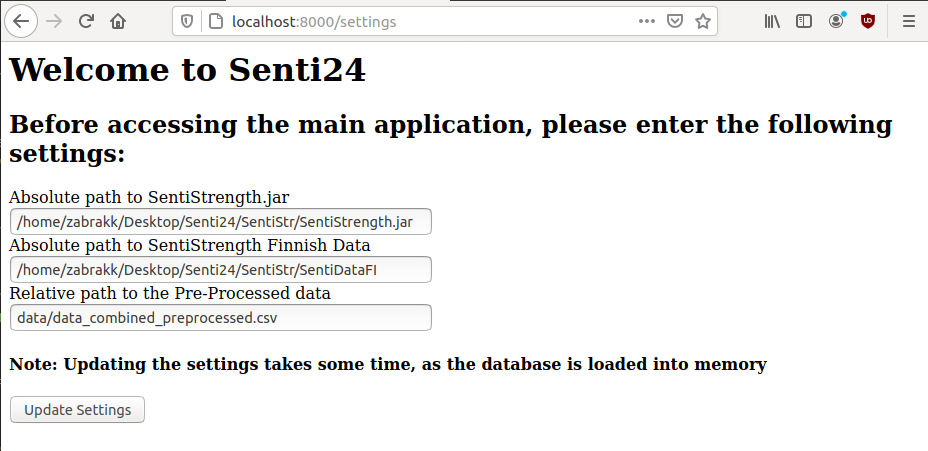
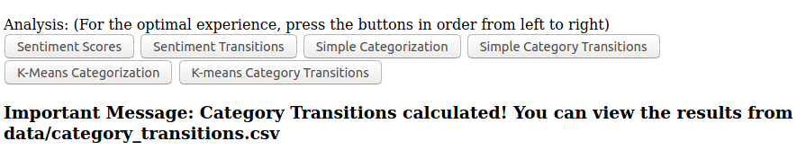

# Senti24

Database with Sentiments and Categories: (ADD LINK HERE)

Full GUI environment: (ADD LINK HERE)

## Setup
The full environment required for the GUI to work, can be downloaded from here: (ADD DROPBOX LINK)

You can install the required Python libraries with:
```bash
$ pip3 install -r requirements.txt
```
Getting word_tokenize() from the NTLK library working, might require some extra steps.

## Running the GUI
After completing the setup, you can run the GUI with the following command:
```bash
$ python3 flask_gui.py
```
Then you can access the web GUI by going to **http://localhost:8000** with your browser

## Using the GUI

### Entering Settings
When you enter the link **http://localhost:8000**, you are first directed to the **/settings** page. There you must specify the absolute path for **SentiStrength.jar and SentiStrengthFI/**. Both can be found in the **SentiStr/** directory.
An example of this can be seen here:

The page will notify you of wrong file paths when you press "Update Settings".

After entering the paths correctly, the pre-processed data will be loaded into memory. This can take some time.
You can access this page again with the link **http://localhost:8000/settings**, or by pressing the "Back to Settings button" on the main page

### Analysis
After completing the settings page, you will be directed to the main page. For the optimal user experience, the analysis/visualization should be done in the order listed below:
* Calculate Sentiment
* Sentiment Evolution
* Sentiment Transitions (Analysis)
* Sentiment Transitions (Visualize)
* Index Correlation
* Simple Categorization (This one takes long)
* Simple Category Transitions Transitions (Analysis)
* Category Transitions
* Zipf's Law
* K-Means Categorization (**Requires the result from Simple Heuristic**) 
    * The result of this is only loaded to memory, not saved!
* K-Means Category Transitions (Must have K-Means Categorization in memory)
* Category Transitions (Must have K-Means Categorization in memory)
* K-Means Zipf's Law (Must have K-Means Categorization in memory)

After pressing one of the "Analysis" buttons and waiting patiently, a message will appear below the buttons informing you that the process has been completed.
Here's an example message:

**NOTE: AFTER PRESSING A BUTTON, WAIT FOR THE PROCESS TO COMPLETE BEFORE PRESSING ANOTHER!**

Below the buttons you can see a graph. If nothing is being plotted, it will display "No data". The "No data" message can also appear if you attempt to visualize data you don't have yet.
The visualization buttons "Sentiment Transitions", "Index Correlation", and "Category Transitions" will direct you to a new page. Fro there you can press the "Back to Main Page" button to return here. 

### Files creted by the Analysis
* Sentiment Calculation: data/sentiment-scores.csv - Pre-processed data + sentiments
    * Used by **ALL** other components!
* Sentiment Transitions: data/sentiment-transitions.csv - Transitions between different Sentiment pairs
* Simple Heuristic: data/sentiment-data+features.csv - **Threads with sentiment, features, and categorization**
* Category Transitions: data/category_transitions.csv - Transitions between different thread categories

## Running codes separately
If you want to run parts of the analysis separately, you must take into account that each of them require different files to be present in the **data/** directory.

You should go into this projects repository, and run them like this:
```bash
$ python3 Senti24/senti_score2.py
```
That way, the file can access **data/**

Codes in the **extra_codes/** folder may not work without slight modifications, due to different paths.