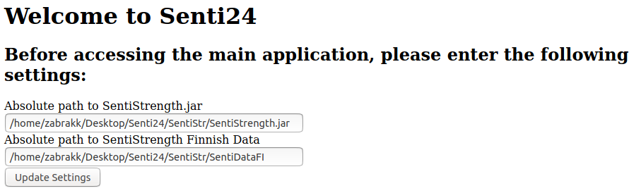

# Project 4: Senti24

## IMPORTANT DOWNLOADS
Pre-processed data for analysis: https://www.dropbox.com/s/xxgg5i6oj1oe2tk/pre-processed-data.zip?dl=1
* **IF YOU WANT TO TEST THE ANALYSIS, YOU MUST DOWNLOAD THIS FILE, EXTRACT IT, AND PLACE THE data_combined_preprocessed.csv IN THE data/ DIRECTORY OF THIS PROJECT!**

Database with Sentiments and Categories: https://www.dropbox.com/s/dnn96hgi59ufivd/database.zip?dl=1
* Read the files as UTF-8, so they will display properly

## Setup
Git clone the project, and go to its directory:
```bash
$ git clone https://github.com/hennas/Senti24.git
$ cd Senti24
```

**Before starting the analysis, you must [download the pre-processed data](https://www.dropbox.com/s/xxgg5i6oj1oe2tk/pre-processed-data.zip?dl=1), extract it, and place it in the data/ folder**. </br>
It contains the 2GB pre-processed data used in the analysis, as files that big can't be uploaded here. You may also need 16GB of RAM to run this code.

You can install the required Python libraries with:
```bash
$ pip3 install -r requirements.txt
```
Getting word_tokenize() from the NTLK library working, might require some extra steps.

## Running the GUI
After completing the setup, you can run the GUI with the following command:
```bash
$ python3 flask_gui.py
```
You can then access the web GUI by going to **http://localhost:8000** with your browser

## Making analysis take less time
If you just want to check that the functionalities work, you can modify line **105 in flask_gui.py** like this:
```python
db = senti.add_sentiment(pd.read_csv('data/data_combined_preprocessed.csv', nrows=200000))
```
This reduces the amount of processed data significantly, just 200000 lines. You can also choose a different number.

**NOTE**: If you do this, you can't test 'Index Correlation' since it requires access to data from all years.

## Using the GUI

### Entering Settings
When you enter the link **http://localhost:8000**, you are first directed to the **/settings** page. There you must specify the absolute path for **SentiStrength.jar and SentiStrengthFI/**. Both can be found in the **SentiStr/** directory.
An example of this can be seen here:


The page will notify you of wrong file paths when you press "Update Settings".
You can access this page again with the link **http://localhost:8000/settings**, or by pressing the "Back to Settings button" on the main page

### Analysis
After completing the settings page, you will be directed to the main page. For the optimal user experience, the analysis/visualization should be done in the order listed below:
* Sentiment Scores (Analysis)
* Sentiment Evolution (Visualize)
* Sentiment Transitions (Analysis)
* Sentiment Transitions (Visualize)
* Index Correlation (Visualize)
* Simple Categorization (Analysis) (This one takes long)
* Simple Category Transitions (Analysis)
* Category Transitions (Visualize)
* Zipf's Law (Visualize)
* K-Means Categorization (Analysis) (**Requires the result from Simple Heuristic**) 
* K-Means Category Transitions (Analysis)
* K-Means Category Transitions (Visualize)
* K-Means Zipf's Law (Visualize)

After pressing one of the "Analysis" buttons and waiting patiently, a message will appear below the buttons informing you that the process has been completed.
Here's an example message:


**NOTE: AFTER PRESSING A BUTTON, WAIT FOR THE PROCESS TO COMPLETE BEFORE PRESSING ANOTHER!**

Below the buttons you can see a graph. If nothing is being plotted, it will display "No data". It will also show an error message for 'Sentiment Evolution', and the 'Zipf's Laws' if you haven't completed the related analysis.

The visualization buttons "Sentiment Transitions", "Index Correlation", and "Category Transitions" will direct you to a new page. Fro there you can press the "Back to Main Page" button to return here. 

### Files creted by the Analysis
* Sentiment Score: data/database.csv - Pre-processed data + sentiments scores
    * Used by **ALL** other components!
* Sentiment Transitions: data/sentiment_transitions.csv - Transitions between different Sentiment pairs
* Simple Heuristic: data/database.csv - Adds features and **categories** to the file created by Sentiment Score
* Category Transitions: data/category_transitions.csv - Transitions between different thread categories
* K-Means Categorization: data/kmeans_categorization.csv - List of categories produced by K-Means
* K-Means Category Transitions: data/kmeans_transitions.csv - Transitions between different thread categories

## Running codes separately
If you want to run parts of the analysis separately, you must take into account that each of them require different files to be present in the **data/** directory.

You should go into this projects repository, and run them like this:
```bash
$ python3 Senti24/senti_score2.py
```
That way, the file can access **data/**

Codes in the **extra_codes/** folder may not work without slight modifications, due to different paths.
